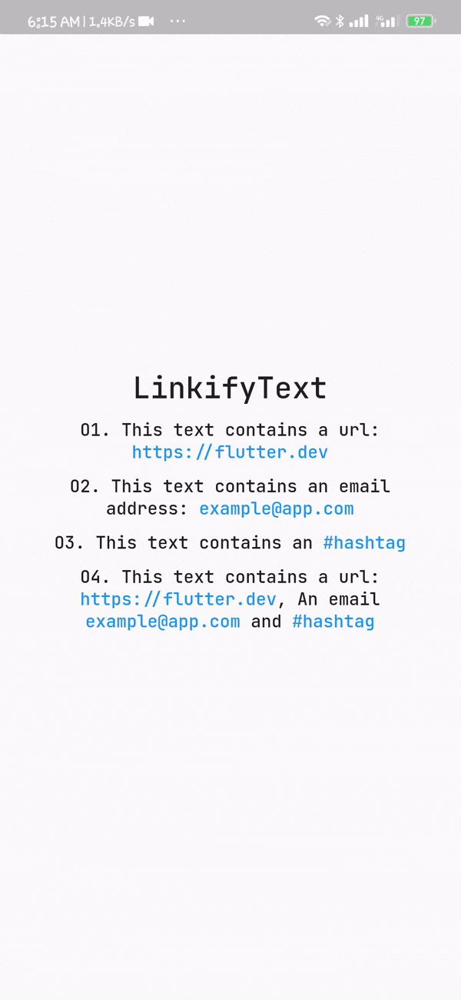

# linkfy_text

A lightweight flutter package to linkify texts containing urls, emails and hashtags.

[](https://pub.dev/packages/linkfy_text)



## Usage

To use this package, add `linkfy_text` as a [dependency in your pubspec.yaml file](https://pub.dev/packages/linkfy_text/).

Example:

```dart
// first import the package
import 'package:linkfy_text/linkify_text.dart';

Container(
    child: LinkifyText(
    "This text contains a url: https://flutter.dev",
    linkStyle: TextStyle(color: Colors.blue, fontSize: 16),
    onTap: (link) {
        /// do stuff with `link`
        },
    );
)
```

Be default, The above snippet would linkify all urls in the string, you can choose what type of link to linkify by passing the `linkTypes` parameter

```dart
Container(
    child: LinkifyText(
    "This text contains a url: https://flutter.dev and #flutter",
    linkStyle: TextStyle(color: Colors.blue, fontSize: 16),
    linkTypes: [LinkType.url, LinkType.hashtag]
    onTap: (link) {
        /// do stuff with `link` like
        /// if(link.type == Linktype.url) launchUrl(link.value);
        },
    );
)
```

| Parameters  | Default        | Description                                                                                                  |
| ----------- | -------------- | ------------------------------------------------------------------------------------------------------------ |
| `textStyle` | `null`         | Style applied to the text                                                                                    |
| `linkStyle` | `null`         | Style applied to the linkified text, defaults to the textStyle                                               |
| `linkTypes` | `LinkType.url` | A list of `LinkTypes` used to override the links to be linkified in the text either a hashtag, email or url. |
| `onTap`     | `null`         | Callback function with a `Link` paramater called when a link is pressed                                      |

# Contributions

Feel free to contribute to this project.

If you find a bug or want a feature, but don't know how to fix/implement it, please fill an [issue][issue].  
If you fixed a bug or implemented a feature, please send a [pull request][pr].
